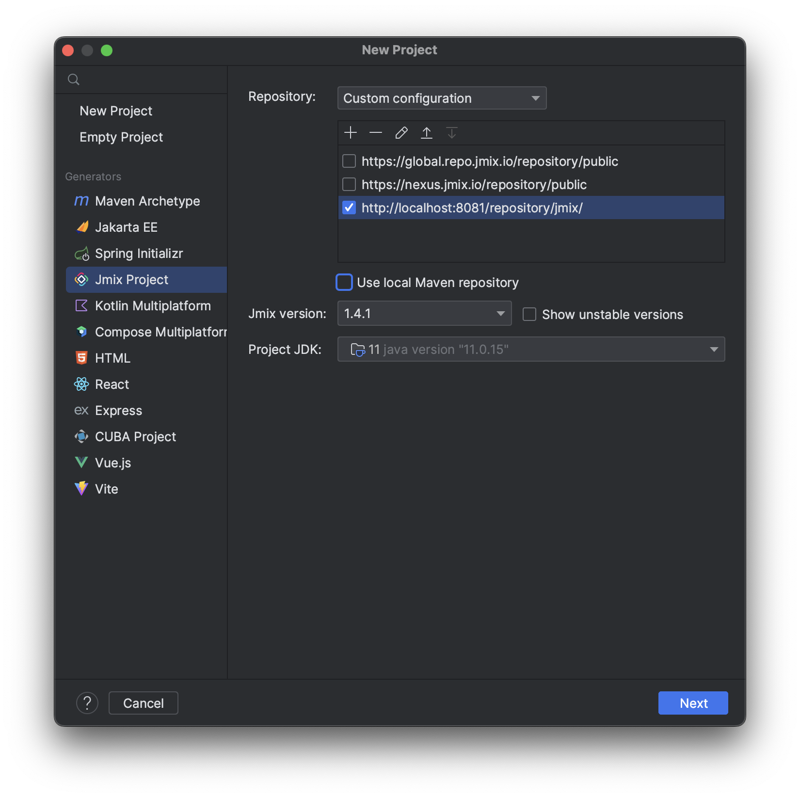
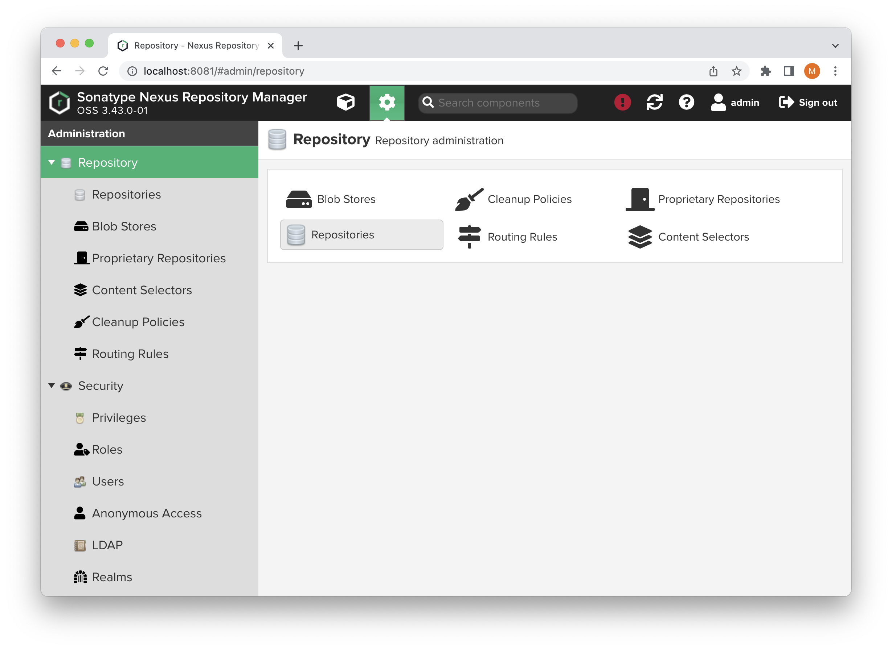
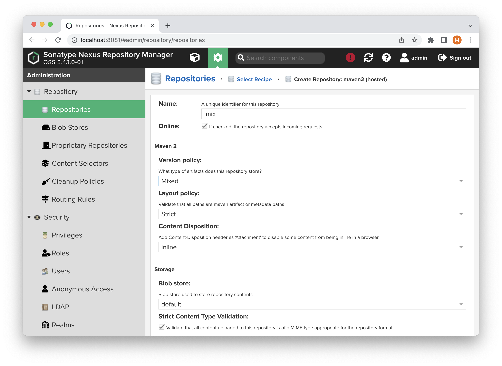

# Jmix Dependencies Tool

## Overview

`deptool` is a command-line utility that helps to prepare custom Nexus repository for developing projects based on Jmix in an isolated environment (without internet access).

`deptool` provides the following functionality:

* resolve all dependencies for Jmix framework
* resolve dependencies for any custom library
* export resolved dependencies in Maven repository format
* upload exported dependencies into custom Nexus repository

## Installation

In order to run the tool Java 11+ must be installed on the machine.

The tool distribution (zip archive) may be downloaded from the [Releases](https://github.com/jmix-framework/jmix-dependencies-tool/releases) page.

After extracting the archive use `bin/deptool.sh` or `bin/deptool.bat` files for executing CLI commands.

Distribution directories structure:

```text
deptool
  -  bin (contains CLI executables)
  -  lib (required Java libraries)
  -  resolver (Gradle project used by the tool to resolve dependencies)
```

## Usage Scenarios

### Fill Custom Nexus Repository with Pre-built Jmix Dependencies

In case application development is done in an isolated environment teams most often have an artifact management system (e.g. Nexus). The `deptool` may be used for uploading Jmix artifacts to custom Nexus repository. An archive with Jmix dependencies may be downloaded from Jmix website (the download link will appear here later).

After the archive is downloaded, unzip it. The [upload](#upload-exported-dependencies-to-nexus-repository-upload) command can be used to upload all jmix dependencies artifacts to the repository, e.g.:

```shell
./deptool upload --nexus-url http://localhost:8081 \
--nexus-repository jmix \
--nexus-username admin \
--nexus-password admin \
--artifacts-dir /opt/dependencies/jmix-dependencies-1.4.2
```

After all artifacts are uploaded to the Nexus repository you should select custom Nexus repository while creating a new Jmix project in IntelliJ Idea. See the [Adopt Projects For Working with Custom Nexus Repository](#adopt-projects-for-working-with-custom-nexus-repository) section.


## Dependencies Resolution

The tool delegates dependencies resolution to a special Gradle project. The flow for getting required dependencies for Jmix framework of specific version or for any other library is the following: 

* We pass dependency coordinates or Jmix version number to the `deptool` command.
* The `deptool` invokes Gradle task of the special **resolver** project that is shipped with in the tool distribution.
* Gradle downloads dependencies artifacts to its artifacts cache.
* Using the `deptool` utility we copy resolved artifacts from Gradle cache into output directory.

### Resolve Jmix Dependencies (resolve-jmix)

The tool can resolve all dependencies required for specific Jmix version.

```shell
./deptool resolve-jmix --jmix-version 1.4.2
```

The command resolves and downloads dependencies required for Jmix starters to the Gradle cache. 

Command options:

* `--jmix-version` (required) - the Jmix framework version.
* `--jmix-plugin-version` - Jmix plugin version. If not defined the value from the `--jmix-version` will be used.
* `--resolve-commercial-addons` - whether to resolve Jmix commercial add-ons. The `--jmix-license-key` option must be provided in this case. By default, only open-source modules dependencies are resolved.
* `--jmix-license-key` - your Jmix license key. This option is required if you resolve Jmix commercial add-ons.
* `--gradle-user-home` - gradle user home directory. It is the directory where dependencies will be downloaded to by Gradle. This directory must distinct from the user home of the gradle installed on your machine in order to contain only dependencies required for Jmix. The default value is `../gradle-home`.
* `--resolver-project` - a path to a spacial gradle project used for dependencies resolution. This project is delivered within the distribution bundle. The default value is `../resolver`.

If you run the command from within the `deptool/bin` directory then the only required option is the `--jmix-version`. Other options have default values that work for that case. If you run the command from some other place then you need to configure a location of gradle home and a location of the resolver project.

### Resolve a Single Library (resolve-lib)

The command transitively resolves artifacts used by any single dependency.

```shell
./deptool resolve-lib javax.validation:validation-api:1.0.0.GA
```

Command options:

* `--jmix-version` - see `resolve-jmix` command documentation. The option is not required for the resolve-lib command.
* `--jmix-plugin-version` - see `resolve-jmix` command documentation.
* `--gradle-user-home` - see `resolve-jmix` command documentation.
* `--resolver-project` - see `resolve-jmix` command documentation.
* `--jmix-license-key` - your Jmix license key. This option is required if you resolve dependencies that use Jmix commercial add-ons.
* `--repository` - additional Maven repository that must be used for dependencies resolution. If no authentication is required then pass repository URL as parameter value. If authentication is required, then pass URL, username and password separated by `|`, e.g. `http://localhost:8081/jmix|admin|admin`


If `--jmix-version` option is defined then Jmix BOM will be used during dependency resolution. Jmix BOM is not used by default.

## Export Resolved Dependencies (export)

The command copies all resolved artifact from the gradle user home directory to the specific target directory. In the target directory files will be organized in a Maven repository format.

```shell
./deptool export
```

By default, if you run the `deptool` from the `deptool/bin` directory the command will export artifacts to the `deptool/export` directory. If you want to change the output directory location, use the `--target-dir` option.

Command options:

* `--target-dir` - a directory where dependencies artifacts will be exported to (`../export` by default).
* `--gradle-user-home` - gradle home directory with resolved dependencies. See `resolve-jmix` command documentation.

## Upload Exported Dependencies to Nexus Repository (upload)

The command uploads artifacts exported by the `export` command to the Nexus repository.

```shell
./deptool upload --nexus-url http://localhost:8081 \
  --nexus-repository jmix \
  --nexus-username admin \
  --nexus-password adminpass \
  --artifacts-dir ../export
```

Command options:

* `--nexus-url` (required) - Nexus repository URL.
* `--nexus-repository` (required) - Nexus repository name.
* `--nexus-username` (required) - Nexus user username.
* `--nexus-password` (required) - Nexus user password.
* `--artifacts-dir` (required) - a directory with artifacts to be uploaded to Nexus.

## Adopt Projects For Working with Custom Nexus Repository

While creating a new Jmix project in Jmix Studio, add custom Nexus repository.



After the project is created, add the following lines to the beginning of the `settings.gradle` using correct Nexus repository URL:

```groovy
pluginManagement {
    resolutionStrategy {
        eachPlugin {
            if (requested.id.id == 'io.jmix') {
                useModule("io.jmix.gradle:jmix-gradle-plugin:${requested.version}")
            }
        }
    }

    repositories {
        maven {
            allowInsecureProtocol true
            url 'http://localhost:8081/repository/jmix/'
            credentials {
                username(rootProject.hasProperty('repoUser') ? rootProject['repoUser'] : 'admin')
                password(rootProject.hasProperty('repoPass') ? rootProject['repoPass'] : 'admin')
            }
        }
    }
}
```

These lines are necessary for resolving Jmix gradle plugin.

`allowInsecureProtocol true` instruction is required if your nexus repository uses http protocol.
Add this instruction to the maven repository configuration in the `build.gradle` file as well.

Remove the `mavenCentral()` instruction from the `repositories` section of the `build.gradle` file.


## Install Custom Nexus Repository

Download [Sonatype Nexus OSS](https://help.sonatype.com/repomanager3/product-information/download/download-archives---repository-manager-3).

Unzip the archive.

Go to the `bin` directory and run Nexus using the command:

On Linux:

```shell
./nexus run
```

On Windows:

```shell
nexus.exe /run
```

Open the URL in the browser: http://localhost:8081

Click the **Sign in** button and change the default admin password.

Go to the **Server administration and configuration** section and click the **Repositories** button.



Click the **Create repository** button and select the `maven2 (hosted)` repository type.

Fill the **Name** field (e.g. `jmix`) and select the **Version policy**: `Mixed`.



## Implementation Details 

### Resolver Project

The `deptool` utility resolves dependencies by invocation of gradle tasks in the `resolver` project that is packed into the distribution. This project contains a simple predefined `build.gradle` file. In this file Jmix plugin and Jmix BOM are enabled if corresponding project properties are defined (`-PjmixVersion` and `-PjmixPluginVersion`). The `build.gradle` also applies a special gradle plugin that contains tasks that do the resolution.

The `JmixDependenciesPlugin` adds the `resolveDependencies` task. This task is invoked by the `deptool` utility for dependencies resolution.

```shell
./gradlew resolveDependencies \
  --dependency javax.validation:validation-api:1.0.0.GA \
  --repository "http://some-external-repo.com:8081/repo|user|password" \
  -PjmixVersion=1.4.2 \
  -PjmixPluginVersion=1.4.2 \
  -PjmixLicenseKey=<your_key>
```


## Building the Distribution

To build the distribution locally run the following command to build the `deptool` tool distribution:

```shell
./gradlew zipDist
```

or pass the "version" parameter if you want to build the distribution with the specific version:

```shell
./gradlew zipDist -Pversion=1.2.3
```

The task produces the `build/distributions/deplool-<version>.zip` archive.

After extracting the archive use `bin/deptool.sh` or `bin/deptool.bat` files for executing CLI commands.

Distribution directories structure:

```text
deptool
  -  bin (contains CLI executables)
  -  lib (required Java libraries)
  -  resolver (Gradle project used by the tool to resolve dependencies)
```