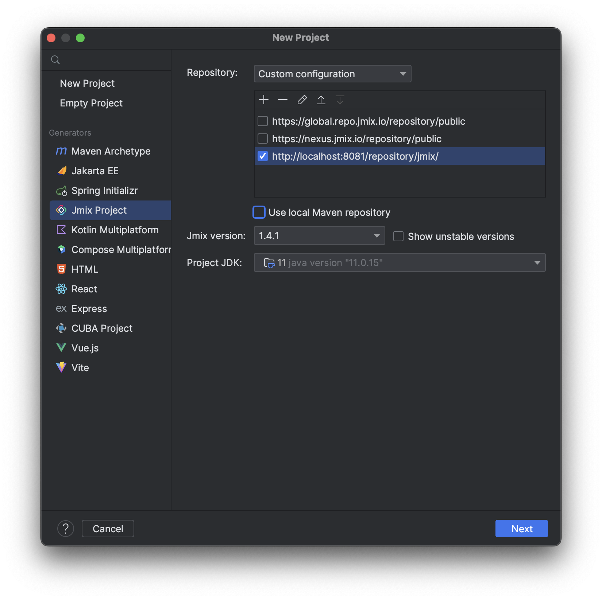
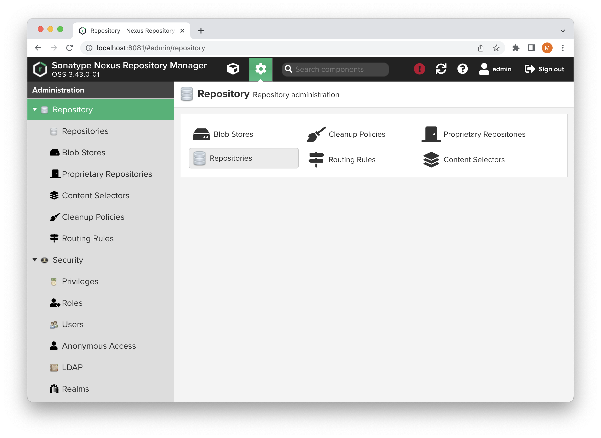
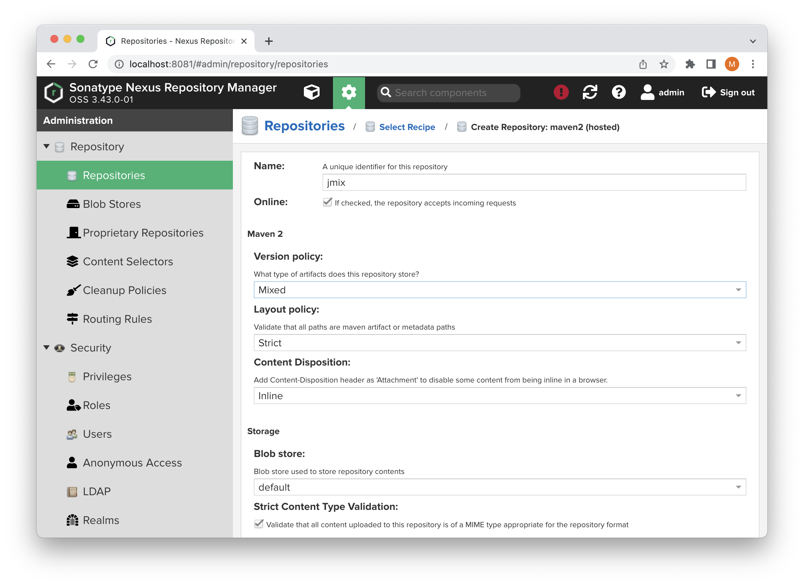

# Jmix Dependencies Tool — v3

`deptool` is a command-line utility that prepares a custom Nexus repository for developing Jmix-based
projects in an isolated environment (no internet access). It:

* resolves the full set of dependencies for a Jmix framework version (Java + npm), including commercial add-ons;
* resolves the dependencies of any single library;
* exports the resolved dependencies as a portable Maven repository (Java) and a folder of `.tgz` archives (npm);
* uploads the exported artifacts into a custom Nexus repository.

Same CLI and same commands as v1/v2 — the internal implementation is reworked for simplicity, durability
across framework versions, and correct npm version coverage (see [Architecture details](#architecture-details)).

```
resolve-jmix   resolve-lib   resolve-npm   export   export-npm   upload   upload-npm
```

## Installation

A Java 17+ runtime must be installed on the machine. **Node.js is not required** — npm export is pure Java,
and `resolve-npm` lets the Vaadin plugin download Node automatically.

The tool distribution (zip archive) is produced by the build (see [Building](#building)) — extract it and
use `bin/deptool` (Linux/macOS) or `bin/deptool.bat` (Windows) to run commands.

Distribution structure:

```text
deptool
  bin/   CLI executables (deptool, deptool.bat)
  lib/   the deptool jar + its Java dependencies
```

Unlike v1/v2 there are no `resolver/` or `npm-resolver/` project directories: the resolution project
templates and the Gradle wrapper are embedded inside the deptool jar and generated at runtime.

## Usage

Run via the launcher in the distribution: `bin/deptool` (Linux/macOS) or `bin/deptool.bat` (Windows).
Examples below use `deptool` for brevity.

### End-to-end workflow

```
# 1. Resolve into a local Gradle cache (Java) and a package-lock.json (npm)
deptool resolve-jmix --jmix-version 2.8.0
deptool resolve-npm  --jmix-version 2.8.0

# 2. Export to portable, uploadable folders
deptool export                         # -> ../export      (Maven repo layout)
deptool export-npm                     # -> ../export-npm  (tgz archives)

# 3. Upload to your Nexus
deptool upload     --nexus-url http://localhost:8081 --nexus-repository jmix     --nexus-username admin --nexus-password admin --artifacts-dir ../export
deptool upload-npm --nexus-url http://localhost:8081 --nexus-repository jmix-npm --nexus-username admin --nexus-password admin --artifacts-dir ../export-npm
```

> **Paths** in defaults are relative to the working directory (typically `deptool/bin`): `../gradle-home`,
> `../work`, `../export`, `../export-npm`, `../npm-work`. Override any of them with the options below.
>
> **Accumulation**: `resolve-*` commands add to the same `--gradle-user-home`. Resolving several Jmix
> versions accumulates all of them; clean `../gradle-home` first if you want a single version only.

### Options common to the resolve commands

These apply to `resolve-jmix`, `resolve-npm`, and `resolve-lib`:

| Option | Default | Description |
|--------|---------|-------------|
| `--jmix-plugin-version` | = `--jmix-version` | Jmix Gradle plugin version, if it differs from the framework version. |
| `--gradle-user-home` | `../gradle-home` | Directory Gradle resolves into (what `export` later reads). |
| `--workspace-dir` | `../work` | Where the throw-away resolution project is generated (`<dir>/project`). |
| `--gradle-version` | per Jmix line¹ | Gradle distribution the generated wrapper downloads and runs. |
| `--jmix-license-key` | – | License key `user-password`; adds the premium repo for commercial artifacts. |
| `--public-repository` | `https://global.repo.jmix.io/repository/public` | Repository for public artifacts. |
| `--premium-repository` | `https://global.repo.jmix.io/repository/premium` | Repository for premium artifacts. |
| `--repository` | – | Extra Maven repo, repeatable. Format `<url>` or `<url>\|<user>\|<pass>`. |

¹ Resolved from `templates/gradle-versions.properties` (`1.0→7.6.4`, `2.0→8.14.4`, `3.0→9.5.1`); `--gradle-version` overrides it.

---

### `resolve-jmix` — all Jmix dependencies (Java)

Resolves the full Java dependency set for a Jmix version (every module in `dependencies-<version>.xml`,
each in isolation plus all together) into `--gradle-user-home`. If no descriptor for the requested version is
bundled, the command **fails** rather than falling back to a generic list — a wrong-but-successful resolve
would silently ship an incorrect dependency set (see [Supporting a new framework version](#supporting-a-new-framework-version)).

| Option | Required | Default | Description |
|--------|:---:|---------|-------------|
| `--jmix-version` | ✓ | – | Jmix framework version, e.g. `2.8.0`. |
| `--resolve-commercial-addons` | | off | Also resolve commercial add-ons (requires `--jmix-license-key`). |
| `--commercial-subscription-plan` | | `bpm` | `enterprise` or `bpm` — which commercial modules to include. Only with `--resolve-commercial-addons`. |
| `--no-sources` | | off | Skip downloading `-sources` jars — much faster. Sources are included by default. |
| *(+ common resolve options above)* | | | |

```
# Open-source only
deptool resolve-jmix --jmix-version 2.8.0

# Including commercial add-ons (enterprise plan)
deptool resolve-jmix --jmix-version 2.8.0 \
  --resolve-commercial-addons --commercial-subscription-plan enterprise \
  --jmix-license-key 1234567-abcdef

# Through a corporate mirror, custom Gradle, custom cache location
deptool resolve-jmix --jmix-version 2.8.0 \
  --public-repository https://nexus.corp/repository/jmix-public \
  --repository "https://nexus.corp/repository/extra|ci|secret" \
  --gradle-version 8.14.4 --gradle-user-home /data/jmix-cache
```

### `resolve-lib` — a single library (Java)

Resolves one dependency and its transitive closure (+ sources).

| Option | Required | Default | Description |
|--------|:---:|---------|-------------|
| `<dependency>` (positional) | ✓ | – | Maven coordinates `group:artifact:version`. |
| `--jmix-version` | | – | If given, the Jmix BOM of that version is applied (use for a library that depends on Jmix modules, or to also collect the Jmix-aligned versions). If omitted, the library is resolved standalone, with no Jmix BOM. |
| `--no-sources` | | off | Skip downloading `-sources` jars — much faster. Sources are included by default. |
| *(+ common resolve options above)* | | | |

```
# Plain library, no Jmix in the picture
deptool resolve-lib com.google.guava:guava:33.0.0-jre

# A Jmix-based add-on (its version-less Jmix deps need the BOM)
deptool resolve-lib com.example:my-jmix-addon:1.0.0 --jmix-version 2.8.0
```

### `resolve-npm` — all npm dependencies (Jmix 2.x+)

Runs Vaadin's `vaadinBuildFrontend` and writes **two** lockfiles into `../npm-work/` (see
[npm resolution](#npm-resolution)): `package-lock.json` (the project's resolved set — Jmix-specific packages)
and `dev-bundle-package-lock.json` (extracted from the resolved `vaadin-dev-bundle` jar — the framework's
frozen versions). `export-npm` unions both. Not supported for Jmix 1.x (no Vaadin frontend).

| Option | Required | Default | Description |
|--------|:---:|---------|-------------|
| `--jmix-version` | ✓ | – | Jmix framework version (must be 2.x+). |
| `--package-lock-output` | | `../npm-work/package-lock.json` | Where the project lockfile is written; the dev-bundle lock is written next to it. |
| `--resolve-commercial-addons` | | off | Include commercial add-ons (requires `--jmix-license-key`). |
| `--commercial-subscription-plan` | | `bpm` | `enterprise` or `bpm`. Only with `--resolve-commercial-addons`. |
| *(+ common resolve options above)* | | | |

```
deptool resolve-npm --jmix-version 2.8.0
deptool resolve-npm --jmix-version 2.8.0 --resolve-commercial-addons --jmix-license-key 1234567-abcdef
```

### `export` — Java artifacts → Maven repo layout

Copies resolved `.jar` / `.pom` / `.module` files from the Gradle cache into a portable Maven repository
directory.

| Option | Default | Description |
|--------|---------|-------------|
| `--gradle-user-home` | `../gradle-home` | Cache to export from (the one the `resolve-*` commands filled). |
| `--target-dir` | `../export` | Output directory (Maven layout). |
| `--report-file` | – | Optional file listing the exported `group:artifact:version`s — one line per module version, sorted, de-duplicated. Includes **pom-only** modules (e.g. `io.jmix.bom`), not just those shipping a jar. |

```
deptool export
deptool export --gradle-user-home /data/jmix-cache --target-dir /data/export \
  --report-file /data/jmix-2.8.0-artifacts.txt
```

### `export-npm` — npm tarballs from the lockfile

Reads the resolved lockfile(s) and downloads each tarball — every **resolved** version plus every
**exact-pin variant** — directly from the registry (pure Java, no Node.js). Multiple lockfiles are
**unioned**; by default it reads both files `resolve-npm` wrote (`package-lock.json` +
`dev-bundle-package-lock.json`). See [npm resolution](#npm-resolution).

| Option | Default | Description |
|--------|---------|-------------|
| `--package-lock-file` | `../npm-work/{package-lock,dev-bundle-package-lock}.json` | Lockfile to mirror; **repeatable**. Defaults to both lockfiles `resolve-npm` produced. |
| `--target-dir` | `../export-npm` | Output directory of `.tgz` archives (+ the lockfile copies). |
| `--npm-registry` | `https://registry.npmjs.org` | Registry used to look up tarballs for variant versions. |
| `--report-file` | – | Optional file listing mirrored (resolved + variant) versions. |

```
deptool export-npm
deptool export-npm --package-lock-file ./a/package-lock.json --package-lock-file ./b/package-lock.json
```

### `upload` / `upload-npm` — push to Nexus

Uploads the exported artifacts to a Nexus repository (Maven `hosted` for `upload`, npm `hosted` for
`upload-npm`). Already-present artifacts are skipped.

| Option | Required | Description |
|--------|:---:|-------------|
| `--nexus-url` | ✓ | Nexus base URL, e.g. `http://localhost:8081`. |
| `--nexus-repository` | ✓ | Target repository name. |
| `--nexus-username` | ✓ | Nexus user. |
| `--nexus-password` | ✓ | Nexus password. |
| `--artifacts-dir` | ✓ | Directory of exported artifacts (`../export` for `upload`, `../export-npm` for `upload-npm`). |

```
deptool upload     --nexus-url http://localhost:8081 --nexus-repository jmix \
  --nexus-username admin --nexus-password admin --artifacts-dir ../export

deptool upload-npm --nexus-url http://localhost:8081 --nexus-repository jmix-npm \
  --nexus-username admin --nexus-password admin --artifacts-dir ../export-npm
```

## Configure Projects For Working with Custom Nexus Repository

While creating a new Jmix project in Jmix Studio, add the custom Nexus repository.



After the project is created, add the following lines to the beginning of the `settings.gradle`, using the
correct Nexus repository URL:

```groovy
pluginManagement {
    resolutionStrategy {
        eachPlugin {
            if (requested.id.id == 'io.jmix') {
                useModule("io.jmix.gradle:jmix-gradle-plugin:${requested.version}")
            }
        }
    }

    repositories {
        maven {
            allowInsecureProtocol true
            url 'http://localhost:8081/repository/jmix/'
            credentials {
                username(rootProject.hasProperty('repoUser') ? rootProject['repoUser'] : 'admin')
                password(rootProject.hasProperty('repoPass') ? rootProject['repoPass'] : 'admin')
            }
        }
    }
}
```

These lines are necessary for resolving the Jmix Gradle plugin.

`allowInsecureProtocol true` is required if your Nexus repository uses the http protocol. Add this
instruction to the maven repository configuration in the `build.gradle` file as well.

Remove the `mavenCentral()` instruction from the `repositories` section of the `build.gradle` file.

### Configure NPM

Copy the previously saved `package-lock.json` file (produced by `resolve-npm`) to the root of your project.

To use a custom npm registry, create a `.npmrc` file at the root of your project and add the following line:
`registry=http://localhost:8081/repository/jmix-npm/`

Additional properties (authentication, etc.) are described in the npm documentation:
https://docs.npmjs.com/cli/v10/configuring-npm/npmrc

## Install Custom Nexus Repository

Download [Sonatype Nexus OSS](https://help.sonatype.com/repomanager3/product-information/download/download-archives---repository-manager-3).

Unzip the archive.

Go to the `bin` directory and run Nexus using the command:

On Linux:

```shell
./nexus run
```

On Windows:

```shell
nexus.exe /run
```

Open the URL in the browser: http://localhost:8081

Click the **Sign in** button and change the default admin password.

Go to the **Server administration and configuration** section and click the **Repositories** button.



Click the **Create repository** button and select the `maven2 (hosted)` repository type.

Fill the **Name** field (e.g. `jmix`) and select the **Version policy**: `Mixed`.



Create the NPM repository the same way — use the `npm (hosted)` repository type and fill the **Name**
(e.g. `jmix-npm`).

## Architecture details

deptool resolves dependencies by generating a throw-away Gradle project that mirrors a real Jmix
application, running it via its own Gradle wrapper (as a subprocess), and then copying the resolved
artifacts out of the Gradle cache. The high-level flow is unchanged from v1/v2 — pass a Jmix version or a
library coordinate, let Gradle download everything, copy it out, upload it — but the internals are reworked.

### What changed vs v1/v2

| Area | v1/v2 | v3 |
|------|-------|----|
| Resolution projects | Two shipped stub projects (`resolver/` for Java + `npm-resolver/` for npm) with frozen `build.gradle` | **One unified project generated at runtime** (Java + Vaadin, like a real app) from versioned templates packaged as resources |
| Build logic | Custom Gradle plugins in `buildSrc` + custom tasks + `inject.gradle` init script | A `resolveAll` task written directly into the generated build script — **no buildSrc, no plugin jar, no init script** |
| `resolve-jmix` | ~`2N+1` separate Gradle builds (per-module loop) | **One** Gradle build with one configuration per module (`iso_<n>`) + all-modules + `noBom` |
| Dependency input | Two mechanisms (`--dependency` task option for Java, `-PexternalDependencies` for npm) | One mechanism: `-PjmixModules` project property for both |
| `export-npm` | `npm install node-tgz-downloader` + `npx download-tgz` (re-resolves peerDependencies → wrong versions) | **Pure Java**: parse the lockfile, collect resolved **+ exact-pin variant** versions, download tarballs from the registry. No Node.js. |
| Additional npm deps | Hand-maintained `additional/npm/<version>/package-lock.json` to recover missed versions | **Removed** — the dev-bundle lock + variant collection cover them automatically |
| Gradle execution | Embedded Gradle Tooling API (one static client version) | **Generated Gradle wrapper run as a subprocess** (`--no-daemon`) — the daemon Gradle is fully decoupled from the tool |
| Gradle version | Tooling API default / `--gradle-version` | **Per-checkpoint** (`gradle-versions.properties`): 1.0→7.6.4, 2.0→8.14.4, 3.0→9.5.1; `--gradle-version` overrides |
| Distribution | deptool + resolver + npm-resolver | Just deptool (templates + Gradle wrapper embedded in the jar) |

### Project structure

```
deptool (single Gradle module)
  src/main/java/io/jmix/dependency/cli/
    command/     CLI commands (JCommander) — one class per command + shared defaults
    gradle/      runs the generated wrapper as a subprocess; builds the shared -P argument list
    workspace/   generates the resolution project + wrapper from templates; checkpoint selection
    npm/         lockfile parsing, variant collection, registry packument lookup, tarball download + verify
    dependency/  reads dependencies-*.xml; Maven coordinates; commercial subscription filtering
    upload/      Nexus upload client + models
    version/     Jmix version parsing / comparison
  src/main/resources/
    jmix-dependencies/dependencies-*.xml   per-version module lists (JVM + NPM scoped)
    templates/
      settings.gradle
      gradle-versions.properties           recommended Gradle distribution per Jmix line
      wrapper/                             bundled Gradle wrapper (jar + gradlew scripts) written into each workspace
      project/build-<x.y>.gradle           project shape for the Jmix line starting at x.y
      project/build-plain.gradle           plain library resolution, no Jmix (resolve-lib without a version)
      project/resolve-support.gradle       shared resolution mechanism (common repos, module deps, iso configs, resolveAll)
      project/frontend-index.html          stub frontend entry for the Vaadin build
```

Package descriptions are intentionally high-level — the purpose of each package, not a class-by-class list.

### One generated project, not two

A real Jmix app is a **single** project that carries both its Java and (via the Vaadin plugin) its npm
dependencies. deptool therefore generates one unified project rather than separate Java/NPM resolvers. The
same generated project serves every command — `resolve-jmix`/`resolve-lib` run its `resolveAll` task,
`resolve-npm` runs `vaadinBuildFrontend` — so Java resolution sees the same graph (Vaadin plugin applied)
it would in a real build. The set of modules added differs only by the scope filter in `dependencies-*.xml`
(JVM vs NPM), passed per command as `-PjmixModules`.

**Shape vs mechanism.** Each `build-<checkpoint>.gradle` describes only the version-specific *shape* — which
plugins, the `jmix{}`/`vaadin{}` blocks, the *version-specific* repositories (`mavenCentral()`,
`gradlePluginPortal()`, and any era repo such as the Shibboleth repo for `jmix-saml`), and any excludes/extra
plugin markers. The version-agnostic *mechanism* — the common repositories (Jmix public/premium +
caller-supplied `extraRepositories`), module dependencies, the per-module `iso_<n>` configurations, and the
`resolveAll` task — lives once in `resolve-support.gradle`, which every template applies via `apply from`. So
a resolution-logic fix is a one-file change, and a new Jmix line is just a small shape template. When a new
version needs a new repository, it goes in as static data in that version's template; the common Jmix repos
are never touched.

Because every per-run value (version, plugin version, repositories, module list) arrives as a `-P` property,
each generated template is a normal runnable Gradle script and can be run by hand for debugging:

```
gradle resolveAll -PjmixVersion=2.8.0 -PjmixPluginVersion=2.8.0 -PjmixModules=io.jmix.flowui:jmix-flowui -PisolatedResolution
gradle vaadinBuildFrontend -PjmixVersion=2.8.0 -PjmixPluginVersion=2.8.0 -PjmixModules=io.jmix.flowui:jmix-flowui
```

### Java resolution

`resolveAll` resolves several configurations in a single Gradle build:

* **all modules together** — the graph a full app produces (`compileClasspath`/`runtimeClasspath`). Always resolved.
* **`iso_<n>`** — one configuration per module, each resolving that module's isolated transitive closure, so
  the versions a *subset* of modules would select are captured too (under the Jmix BOM);
* **`noBom`** — explicitly-versioned libraries resolved without the BOM.

The `iso_<n>` and `noBom` configurations are created only when the **`-PisolatedResolution`** property is
present. It is the switch that turns on this extra per-module coverage: `resolve-jmix` and `resolve-lib` pass
it automatically (they want the widest possible set of versions), while `resolve-npm` does not — the Vaadin
frontend build only needs all modules together on the classpath, so the per-module configurations would be
wasted work there.

Sources (`-sources` jars) are fetched for every resolved component unless `--no-sources` is passed; the
query is de-duplicated across the heavily-overlapping configurations. `iso_<n>` names are zero-padded to a
fixed width so they process in numeric order.

**Pom-only jar recovery.** Gradle downloads the jar of only the *winning* version of each module in a
conflict; for every other version it considered it downloads the `.pom` (to compare candidates) but no jar.
A downstream project with a different module subset can legitimately select one of those non-winning
versions, so its jar must still be in the mirror. After the normal resolve, `resolveAll` scans the Gradle
module cache for every module version that has metadata (`.pom`/`.module`) but no main jar and downloads the
missing jar through a detached, conflict-free configuration — looped to a fixpoint, since a recovered
version's closure can reveal further pom-only versions. Modules whose pom declares `packaging=pom` (BOMs and
parent poms, e.g. `io.jmix.bom`) are left as metadata-only, since they have no jar by design. Scanning the
cache (rather than the resolution graph) catches both conflict *losers* and *ghosts* — versions whose pom was
fetched while exploring a parent that was later evicted and so never appear in the final graph.

### npm resolution

`resolve-npm` runs Vaadin's `vaadinBuildFrontend` on the generated project and produces **two** lockfiles in
`../npm-work/`:

1. **`package-lock.json`** — the project's resolved npm graph. A stub `package-lock.json` is seeded first so
   Vaadin's post-build cleanup leaves it in place. This contributes the **Jmix-specific** packages (e.g.
   `ace-builds`, amCharts) that no shipped Vaadin bundle contains.
2. **`dev-bundle-package-lock.json`** — the `package-lock.json` extracted from the resolved
   `com.vaadin:vaadin-dev-bundle-<version>.jar` (found by name, so it tracks whatever Vaadin the BOM selects).
   This is the framework's **frozen** version set (the whole Vaadin + dev/build toolchain), requiring no app
   run.

`export-npm` unions both lockfiles and, for each package, downloads (pure Java, straight from the registry):

* every **resolved** version, and
* every **exact-pin variant** — a version named exactly anywhere in either lock that differs from a resolved
  one (looked up via the registry packument when it has no `resolved` URL).

The result mirrors both the frozen framework versions and the Jmix component packages, so an offline project
resolves npm dependencies consistently in both dev and prod mode. Full semver-range mirroring is
intentionally not done.

### Gradle version handling

deptool does not embed the Gradle Tooling API. Each generated workspace gets a Gradle **wrapper** whose
`distributionUrl` is the version recommended for the Jmix line (from `gradle-versions.properties`, using the
checkpoint rule below), and the wrapper is run as a subprocess with `--no-daemon`. Consequences:

* The tool's own Gradle/JVM is decoupled from the daemon Gradle — one binary resolves 1.x (Gradle 7), 2.x
  (Gradle 8) and 3.x (Gradle 9.5) builds, each on its own wrapper-downloaded distribution.
* `--gradle-version` overrides the recommended version per run.
* The only host requirement is a JVM that can launch every distribution: **JDK 17 covers Gradle 7.x–9.x.**
* `--no-daemon` means nothing lingers to lock the gradle-user-home that `export` later walks.

### Checkpoint template selection

`WorkspaceManager` selects a build template by **checkpoint**: a template `build-<X.Y>.gradle` means "this
project structure starts at Jmix X.Y", and the chosen one is the **greatest checkpoint ≤ the requested
version**:

```
checkpoints {1.0, 2.0, 2.1, 2.4, 2.4.2, 3.0}
  2.0.5 -> build-2.0     2.1.0 -> build-2.1     2.8.0 -> build-2.4.2     3.4.0 -> build-3.0
```

So a template applies to its version and every later one **until the next checkpoint** — a template is added
only when the project structure actually changes (no per-minor churn), and a future version with no
checkpoint yet uses the latest one (logged). File names use precise versions (`build-2.4.2.gradle`), not
`.x`. The same checkpoint rule drives `gradle-versions.properties`.

When **no** version is supplied (`resolve-lib <dep>` for a plain library) the template is always
`build-plain.gradle`, a minimal Java-only template with no Jmix plugin/BOM. (`resolve-lib` keeps
`--jmix-version` for the case of a library that itself depends on Jmix modules: supplying it selects a Jmix
template so the BOM governs the transitive versions; omitting it uses `build-plain.gradle`.)

### Supporting a new framework version

1. Add `dependencies-<minor>.xml` (the module list) — **this is usually the only step.** There is no default
   fallback: resolving a version with no descriptor **fails fast** rather than shipping a generic/incorrect set.

   > **Optional `compileOnly` dependencies must be listed explicitly.** Some Jmix modules declare optional
   > integrations as `compileOnly` (e.g. `net.sf.jasperreports:jasperreports` in `jmix-reports`, Hazelcast,
   > Oracle EclipseLink). `compileOnly` is not transitive and is absent from the published module POMs, so it
   > **cannot** be discovered by resolving the modules — you must add these coordinates to
   > `dependencies-<minor>.xml`, **version-less** (the Jmix BOM manages their versions). Add a coordinate only
   > if it is declared as `compileOnly` *framework-wide*: if any module also declares it as a normal
   > `api`/`implementation` dependency (e.g. `spring-boot-starter-quartz` via `jmix-quartz`), it is already
   > resolved transitively — do not add it. To find the true set, survey the framework source:
   > `grep -rE "(api|implementation)[ (]+['\"]<group:artifact>" --include=*.gradle` (excluding `bom.gradle`,
   > whose `api` entries are only BOM version constraints) — an empty result means it belongs in the list.
2. *(npm)* nothing — the dev-bundle lock + variant collection handle missed versions automatically.
3. **Only if the project shape changed at this version** (a plugin added/removed, a settings block dropped, a
   new repository required): add a checkpoint template `build-<X.Y>.gradle`. It applies from X.Y forward until
   the next checkpoint, so versions where nothing changed inherit the nearest earlier template. A new
   repository goes in as static data (the common Jmix repos are already shared).
4. **Only if the line uses a new Gradle baseline**: add one line to `gradle-versions.properties`
   (e.g. `3.0 = 9.5.1`).

## Building

A Java 17+ JDK is required to build the distribution.

```
gradlew zipDist        # -> build/distributions/deptool-<version>.zip  (bin/ + lib/)
gradlew installDist    # -> build/install/deptool/bin/deptool[.bat]
```

Pass a `version` to stamp the archive:

```
gradlew zipDist -Pversion=1.2.3
```

After extracting the archive use `bin/deptool` or `bin/deptool.bat` to run CLI commands.
